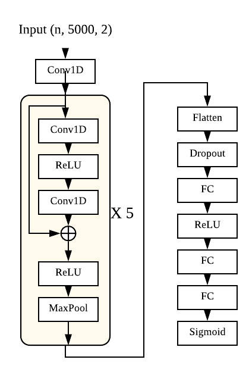
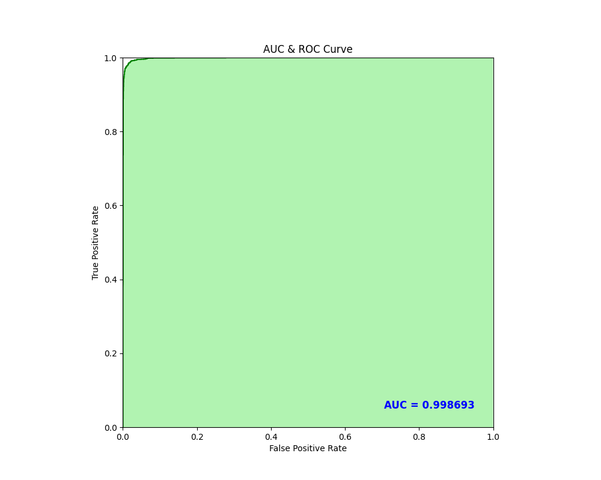

# HEART DISEASE AI DATATHON 2021
[[Eng]](#English) / [[Kor]](#Korean)

---
<p id='English'>This is an AI diagnosis modeling contest that uses the heart disease echocardiography and electrocardiogram datasets for artificial intelligence learning promoted as part of the "2021 AI Learning Data Construction Project" to discriminate echocardiography/electrocardiogram diseases.</p>

## Task II. Arrythmia on ECG datasets

## 0. Model
Resnet-based architecture. <br>
Best AUC-ROC Score: 0.9986926250732517



## 1. Installation

### 1.1. Environment
Python >= 3.6

### 1.2. Requirements:
- tensorflow >= 2.5
- xmltodict
- scikit-learn
- matplotlib
- numpy

```bash
pip install -r requirements.txt
```

## 2. Usage

### 2.1. Training
 1. Basic usage
```bash
python train.py -d electrocardiogram/data/train -s model.h5
```
2. Training with 8 leads inputs, elevation adjustment, data augmentation and gqussian noises
```bash
python train.py -d electrocardiogram/data/train -s model.h5 -l 8 -v -a -n
```

To see more options:
```bash
python train.py -h
```
- options:
  - -d, --data : File path of training data
  - -s, --save : File name for saving trained model (extension should be '.h5')
  - -b, --batch : Batch size (default=500)
  - -e, --epoch : Number of epochs (default=50)
  - -l, --lead : Number of leads to be trained (2/8/12) (default=2)
  - -v, --elevation : Option for adjusting elevation
  - -a, --augmentation : Option for data augmentation (stretching & amplifying)
  - -n, --noise : Option for adding noise on data

### 2.2. Evaluation
1. Basic usage
```bash
python eval.py -d electrocardiogram/data/validation -m model.h5
```
2. Evaluation with the best model
```bash
python eval.py -d electrocardiogram/data/validation -m best.h5
```
3. Evaluation with 12 leads inputs and elevation adjustment
```bash
python eval.py -d electrocardiogram/data/validation -m model.h5 -l 12 -v
```

To see more options:
```bash
python eval.py -h
```
- options:
  - -d, --data : File path of validation data
  - -m, --model : File name of saved model
  - -l, --lead : Number of leads being trained (default=2) (2/8/12)
  - -v, --elevation : Option for adjusting elevation

---

<p id='Korean'>심초음파/심전도 AI 모델 데이터톤 2021<br>
<br>
이 경진대회는 "2021 인공지능 학습용 데이터 구축사업"의 일환으로 추진된 인공지능 학습용 심장질환 심초음파 및 심전도 데이터셋을 이용하여 심초음파/심전도 질환을 판별하는 AI 진단 모델링 경진대회입니다.</p>

## Task II. Arrythmia on ECG datasets

심전도 데이터셋을 활용한 부정맥 진단 AI 모델 공모(심전도 데이터셋을 활용한 부정맥 진단 AI 모델 개발)

## 0. 모델

Resnet 구조 기반의 Binary classification model. <br>
Best AUC-ROC Score: 0.9986926250732517





## 1. 설치

### 1.1. 환경
Python >= 3.6

### 1.2. 필요한 패키지:
- tensorflow >= 2.5
- xmltodict
- scikit-learn
- matplotlib
- numpy

```bash
pip install -r requirements.txt
```

## 2. 사용법

### 2.1. Training
 1. 기본 사용법 예시 (제출용)
```bash
python train.py -d electrocardiogram/data/train -s model.h5
```
2. 8개 리드, 상하조정, 데이터 어그멘테이션, 노이즈 적용
```bash
python train.py -d electrocardiogram/data/train -s model.h5 -l 8 -v -a -n
```

To see more options:
```bash
python train.py -h
```
- options:
  - -d, --data : 트레이닝 데이터 경로
  - -s, --save : 학습된 모델명 (확장자 .h5로 써줄 것)
  - -b, --batch : 배치 사이즈 (default=500)
  - -e, --epoch : 에포크 수 (default=50)
  - -l, --lead : 트레이닝에 쓸 리드 수 (2/8/12) (default=2)
  - -v, --elevation : 상하 조정 옵션
  - -a, --augmentation : 데이터 어그멘테이션 옵션 (stretching & amplifying)
  - -n, --noise : 가우시안 노이즈 적용 옵션

### 2.2. Evaluation
1. 기본 사용법 예시
```bash
python eval.py -d electrocardiogram/data/validation -m model.h5
```
2. 체출된 Best model 평가 (제출용)
```bash
python eval.py -d electrocardiogram/data/validation -m best.h5
```
3. 12개 리드, 상하조정 적용
```bash
python eval.py -d electrocardiogram/data/validation -m model.h5 -l 12 -v
```

To see more options:
```bash
python eval.py -h
```
- options:
  - -d, --data : 벨리데이션 데이터 경로
  - -m, --model : 불러올 모델 파일명
  - -l, --lead : 트레이닝된 리드 수 (2/8/12) (default=2)
  - -v, --elevation : 상하 조정 옵션
